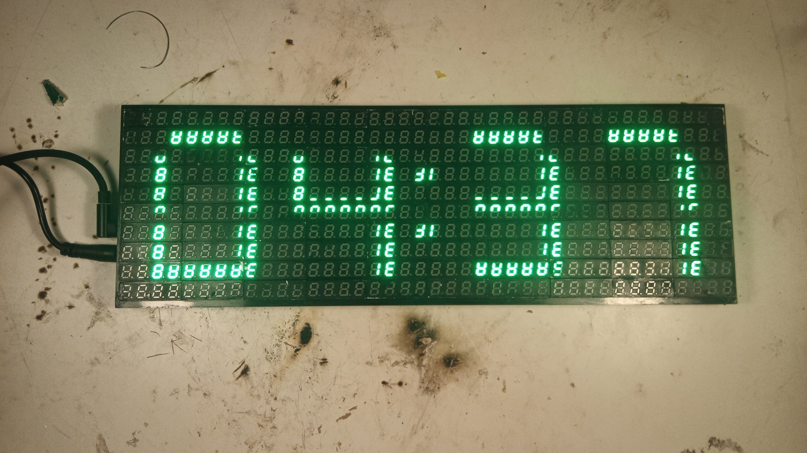
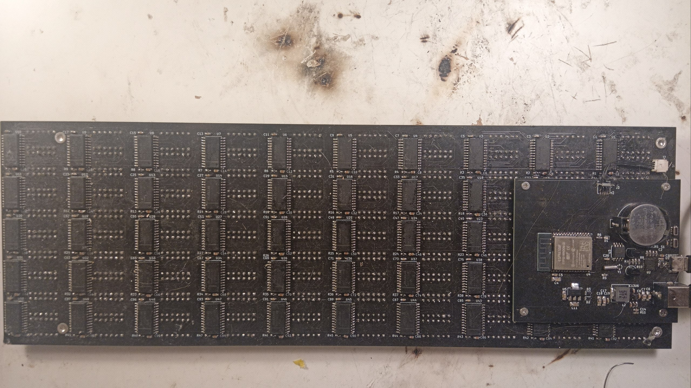

# INDICATRON
Display/Clock with 100 4bit seven-segment 0.28 Inch indicators, RTC and Wi-Fi support.

Project is separated into two PCBs for modular design.\
Requires a 9–12V / 5A power supply.

[Bad apple on this shit](https://youtu.be/xxxx)

# Animation example:

# Pictures:

